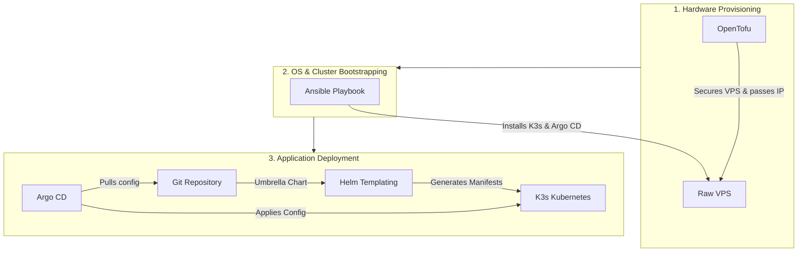

# fleetros-deploy

Infrastructure and GitOps configuration for the Fleetros stack. See `/memories/session/plan.md` in the agent workspace for the full architecture rationale.

## Architecture Flow

This repository uses a multi-stage approach to go from raw hardware to deployed applications:



## Layout

```
infra/
├── ansible/        # OS hardening, K3s install, Argo CD bootstrap, secret seeding
└── tofu/           # OpenTofu modules (BYO-VPS friendly; provider-pluggable)

gitops/
├── bootstrap/      # Argo CD root app-of-apps Application
├── charts/fleetros # Umbrella Helm chart with data/platform/web subcharts
├── apps/           # Per-domain Argo CD Applications
└── environments/
    ├── local/      # multipass VM / k3d profile (self-signed TLS, MinIO backups, dummy secrets)
    └── prod/       # Real VPS profile (LE DNS-01, B2 backups, vault-encrypted secrets)
```

## Phase 0 — Local validation (use this first)

Goal: prove the entire stack on your laptop before touching a VPS.

### Prerequisites (one-time)

```bash
# Linux host
sudo snap install multipass
# OR: brew install multipass on macOS

# Always required
sudo apt install -y ansible podman
pipx install ansible-core
helm repo add argo https://argoproj.github.io/argo-helm

# Browser-trusted local TLS (required for Phase 0)
# Linux: sudo apt install libnss3-tools && download mkcert from
#        https://github.com/FiloSottile/mkcert/releases
# macOS: brew install mkcert nss
mkcert -install   # adds the local CA to your OS + browser trust store

# Optional: fast inner-loop on Podman
brew install k3d   # or scoop / apt
```

> **Why mkcert?** Self-signed certs make the browser show a "Not secure" /
> `NET::ERR_CERT_AUTHORITY_INVALID` warning, which also makes server-side
> `fetch()` calls from the Next.js dashboard fail with
> `ERR_SSL_WRONG_VERSION_NUMBER`. mkcert generates a local Certificate
> Authority that your OS/browser trust; the Ansible bootstrap copies that CA
> into the cluster and configures cert-manager to issue per-host certs from
> it. Result: every `*.fleetros.local` URL is fully trusted, no warnings.

### Bring up local VM + cluster

```bash
make local-up        # provisions multipass VM, runs Ansible, installs K3s + Argo CD
make local-deploy    # applies Argo CD root app pointing at environments/local/
make local-test      # 7-point validation suite
```

### Tear down

```bash
make local-down      # multipass delete --purge
```

## Phase 1+ — Production (after Phase 0 passes)

```bash
# Option A: BYO-VPS — rent any cheap VPS, put its IP in inventory/prod.yml
make prod-configure  # runs same Ansible playbooks, different inventory + values

# Option B: OpenTofu provisioning (provider-specific module under infra/tofu/)
make prod-up         # tofu apply + Ansible
make prod-deploy     # apply Argo CD root app pointing at environments/prod/
```

## Conventions

- **No CI server.** Developers run `docker build && docker push so0n/<service>:vX.Y.Z` from their own machines.
- **Argo CD Image Updater** on the VPS polls Docker Hub every 2 min and bumps tags in the gitops repo.
- **Argo CD** syncs gitops repo → cluster every 3 min.
- **Tag convention**: semver `vMAJOR.MINOR.PATCH` for prod overlay; `main-<sha>` allowed in local overlay.

## Stateful services

- **PostgreSQL is managed by [StackGres](https://stackgres.io/)**. The
  operator is installed by Ansible bootstrap; the umbrella chart only ships
  `SGCluster` / `SGScript` / `SGInstanceProfile` custom resources. StackGres
  bundles Patroni HA, pgBouncer connection pooling, Prometheus exporters and
  Grafana dashboards out of the box, so no separate monitoring stack is
  needed.
- The cluster Service stays at `postgres.data.svc.cluster.local:5432` so
  Keycloak and every Spring service keep their existing JDBC URLs.
- The **StackGres Web UI** is exposed at `https://stackgres.fleetros.local`
  using the same Ingress pattern as Argo CD. Print credentials with:
  `make local-stackgres-ui`.

## Adding a New Service

To add a new microservice to the deployment stack, you need to modify three configuration areas:

**1. Define the service defaults**  
In `gitops/charts/fleetros/values.yaml`, add your service under `platform.services`:
```yaml
    newservice:
      enabled: true
      image: so0n/car-rental-new-service
      tag: "latest"
      port: 8080
```

**2. Inject Environment Variables and Ingress (Per Environment)**  
In `gitops/environments/local/values.yaml` (and similarly for `prod`), override the configuration with environment-specific properties:
```yaml
    newservice:
      ingressHost: new-api # Exposes via https://new-api.fleetros.local
      env:
        SPRING_PROFILES_ACTIVE: dev
        CUSTOM_API_KEY: "your-secret-key"
```

**3. Enable Auto-Updates (Optional)**  
If you want Argo CD Image Updater to automatically deploy new tags for this service, add the annotations in `gitops/bootstrap/root-app-local.yaml` (and `root-app-prod.yaml`):
```yaml
    argocd-image-updater.argoproj.io/image-list: |
      ...,
      newservice=so0n/car-rental-new-service
    argocd-image-updater.argoproj.io/newservice.update-strategy: latest
    argocd-image-updater.argoproj.io/newservice.allow-tags: "regexp:^main-.+"
```

**4. Commit & Push to git repo**
to let the argo take the changes, commit the code change and push to the git repo. Argo will automatically pickup the changes and do deployment.

## Publishing Tenant Sites (multi-tenant website-builder)

The `customer` subchart (image `so0n/fleetros-website-builder`) hosts published tenant sites at `https://<slug>.portal.fleetros.local`. The Ingress is wildcard-aware (`customer.wildcardSubdomain: true` — see [gitops/charts/fleetros/charts/customer/values.yaml](gitops/charts/fleetros/charts/customer/values.yaml)), so Traefik routes any `*.portal.<domain>` host to the same Service and cert-manager mints a wildcard SAN on `fleetros-customer-tls`.

### Local: add the slug to `/etc/hosts`

```bash
# Run WITHOUT sudo — the recipe sudoes internally so multipass can still
# query the VM IP under your user. Pass space-separated slugs.
make local-hosts-install LOCAL_TENANT_HOSTS="tripz-car-rental acme-rentals"

# Verify
getent hosts tripz-car-rental.portal.fleetros.local
curl -kI https://tripz-car-rental.portal.fleetros.local/
```

Append every newly published slug to `LOCAL_TENANT_HOSTS` and re-run the target. The line in `/etc/hosts` is rewritten in place (matched by the trailing `# fleetros-local` comment).

### Why this is needed in local but not in production

| Layer            | Local (`fleetros.local`)                                              | Prod (`fleetros.example`)                                                    |
| ---------------- | --------------------------------------------------------------------- | ---------------------------------------------------------------------------- |
| **DNS**          | `/etc/hosts` — **cannot wildcard**, one literal name per entry        | Real DNS provider — single `*.portal.fleetros.example` A record covers all   |
| **TLS issuer**   | mkcert root CA (`ClusterIssuer` kind: ca) — signs any SAN, incl. `*.` | Let's Encrypt **DNS-01** ACME — only DNS-01 can issue wildcard certs         |
| **Per-tenant**   | Edit `/etc/hosts` after each publish                                  | Zero work — wildcard DNS + wildcard cert cover every new slug automatically  |

So the manual hosts step is purely a workaround for the static, non-wildcard `/etc/hosts` file. In prod, once the wildcard A record and the LE DNS-01 issuer are in place (see [infra/ansible/group_vars/prod/main.yml](infra/ansible/group_vars/prod/main.yml) and [infra/ansible/roles/bootstrap/templates/cluster-issuer.yaml.j2](infra/ansible/roles/bootstrap/templates/cluster-issuer.yaml.j2)), publishing a tenant requires no infrastructure change at all.

### Persistence

Published sites are written to `/app/public/sites/<slug>` inside the pod. That path is backed by a `ReadWriteOnce` PVC (`fleetros-customer-sites`, default 5Gi, `local-path` storage class on k3s) so they survive pod restarts. Override size/storage class in `customer.persistence` per environment.

> If you scale `customer` beyond 1 replica in prod, switch `persistence.accessModes` to `ReadWriteMany` and use an RWX storage class (NFS, Longhorn, …) — otherwise different replicas serve different copies.

## StackGres backups (view / restore)

StackGres only supports S3-compatible object storage as a backup target — there is no filesystem driver. In **local**, the `data` subchart ships a single-node MinIO whose data dir is a **hostPath on the k3s VM** (`/var/lib/fleetros/stackgres-backups`), so the backups live as plain files on the multipass filesystem and can be copied out with `tar` / `rsync`. In **prod**, set `data.minio.enabled: false` and point `data.postgres.backups.objectStorage` at a real bucket (B2 / S3 / GCS).

### What is enabled in local

- Daily base backup at **02:00 UTC** (`cronSchedule: "0 2 * * *"`)
- Sliding **7-day retention** — operator prunes the oldest base backup + its WALs once exceeded
- Continuous WAL archiving in between (point-in-time recovery)
- Bucket: `stackgres-backups` on `http://minio.data.svc.cluster.local:9000`
- Credentials: Secret `stackgres-backup-creds` (`accessKeyId` / `secretAccessKey`) in the `data` namespace

### View backups

```bash
# Via Kubernetes — what StackGres knows about
kubectl -n data get sgbackup
kubectl -n data describe sgbackup <name>

# Via the StackGres UI (recommended)
make local-stackgres-ui          # prints URL + admin password
# → open https://stackgres.fleetros.local → Clusters → postgres → Backups

# Via the filesystem on the VM (raw WAL-G layout)
multipass shell fleetros-local
sudo ls -lh /var/lib/fleetros/stackgres-backups/stackgres-backups/

# Via the MinIO console
kubectl -n data port-forward svc/minio 9001:9001
# → open http://localhost:9001 (login: minioadmin / minioadmin)
```

### Trigger an ad-hoc backup

```bash
cat <<YAML | kubectl apply -f -
apiVersion: stackgres.io/v1
kind: SGBackup
metadata:
  name: manual-$(date +%Y%m%d-%H%M%S)
  namespace: data
spec:
  sgCluster: postgres
  managedLifecycle: false      # excluded from retention pruning
YAML
kubectl -n data get sgbackup -w
```

### Restore into a fresh cluster

StackGres restores by creating a **new** SGCluster whose `initialData.restore.fromBackup` points at an existing SGBackup. You then cut traffic over by renaming Services (or just bring up alongside as `postgres-restored` and re-point apps).

```bash
# 1. Pick a backup
kubectl -n data get sgbackup
BACKUP=<name-from-list>

# 2. Create the restore cluster (re-uses postgres-profile / -config / -pooling)
cat <<YAML | kubectl apply -f -
apiVersion: stackgres.io/v1
kind: SGCluster
metadata:
  name: postgres-restored
  namespace: data
spec:
  instances: 1
  postgres:
    version: "16"
  sgInstanceProfile: postgres-profile
  configurations:
    sgPostgresConfig: postgres-config
    sgPoolingConfig: postgres-pooling
  pods:
    persistentVolume:
      size: 10Gi
  initialData:
    restore:
      fromBackup:
        name: ${BACKUP}
YAML

# 3. Wait for the new primary
kubectl -n data wait sgcluster/postgres-restored --for=condition=PodScheduled --timeout=5m
kubectl -n data get pods -l app=StackGresCluster

# 4. Cut over (option A: re-point apps to postgres-restored.data.svc:5432)
#    or (option B: delete the old cluster and rename the new one to `postgres`)
```

> **Off-VM copy** (disaster recovery for the local stack): the backup files are plain WAL-G output on the VM at `/var/lib/fleetros/stackgres-backups`. A simple `multipass transfer fleetros-local:/var/lib/fleetros/stackgres-backups ./backup-archive` (run as root via `multipass exec`) is enough to mirror them to your host.
