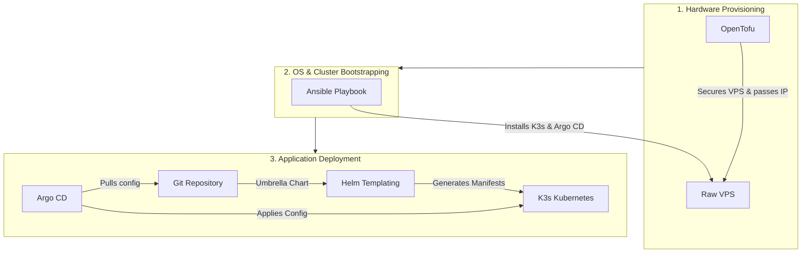

# fleetros-deploy

Infrastructure and GitOps configuration for the Fleetros stack. See `/memories/session/plan.md` in the agent workspace for the full architecture rationale.

## Architecture Flow

This repository uses a multi-stage approach to go from raw hardware to deployed applications:



## Layout

```
infra/
├── ansible/        # OS hardening, K3s install, Argo CD bootstrap, secret seeding
└── tofu/           # OpenTofu modules (BYO-VPS friendly; provider-pluggable)

gitops/
├── bootstrap/      # Argo CD root app-of-apps Application
├── charts/fleetros # Umbrella Helm chart with data/platform/web subcharts
├── apps/           # Per-domain Argo CD Applications
└── environments/
    ├── local/      # multipass VM / k3d profile (self-signed TLS, MinIO backups, dummy secrets)
    └── prod/       # Real VPS profile (LE DNS-01, B2 backups, vault-encrypted secrets)
```

## Phase 0 — Local validation (use this first)

Goal: prove the entire stack on your laptop before touching a VPS.

### Prerequisites (one-time)

```bash
# Linux host
sudo snap install multipass
# OR: brew install multipass on macOS

# Always required
sudo apt install -y ansible podman
pipx install ansible-core
helm repo add argo https://argoproj.github.io/argo-helm

# Optional: fast inner-loop on Podman
brew install k3d   # or scoop / apt
```

### Bring up local VM + cluster

```bash
make local-up        # provisions multipass VM, runs Ansible, installs K3s + Argo CD
make local-deploy    # applies Argo CD root app pointing at environments/local/
make local-test      # 7-point validation suite
```

### Tear down

```bash
make local-down      # multipass delete --purge
```

## Phase 1+ — Production (after Phase 0 passes)

```bash
# Option A: BYO-VPS — rent any cheap VPS, put its IP in inventory/prod.yml
make prod-configure  # runs same Ansible playbooks, different inventory + values

# Option B: OpenTofu provisioning (provider-specific module under infra/tofu/)
make prod-up         # tofu apply + Ansible
make prod-deploy     # apply Argo CD root app pointing at environments/prod/
```

## Conventions

- **No CI server.** Developers run `docker build && docker push so0n/<service>:vX.Y.Z` from their own machines.
- **Argo CD Image Updater** on the VPS polls Docker Hub every 2 min and bumps tags in the gitops repo.
- **Argo CD** syncs gitops repo → cluster every 3 min.
- **Tag convention**: semver `vMAJOR.MINOR.PATCH` for prod overlay; `main-<sha>` allowed in local overlay.

## Adding a New Service

To add a new microservice to the deployment stack, you need to modify three configuration areas:

**1. Define the service defaults**  
In `gitops/charts/fleetros/values.yaml`, add your service under `platform.services`:
```yaml
    newservice:
      enabled: true
      image: so0n/car-rental-new-service
      tag: "latest"
      port: 8080
```

**2. Inject Environment Variables and Ingress (Per Environment)**  
In `gitops/environments/local/values.yaml` (and similarly for `prod`), override the configuration with environment-specific properties:
```yaml
    newservice:
      ingressHost: new-api # Exposes via https://new-api.fleetros.local
      env:
        SPRING_PROFILES_ACTIVE: dev
        CUSTOM_API_KEY: "your-secret-key"
```

**3. Enable Auto-Updates (Optional)**  
If you want Argo CD Image Updater to automatically deploy new tags for this service, add the annotations in `gitops/bootstrap/root-app-local.yaml` (and `root-app-prod.yaml`):
```yaml
    argocd-image-updater.argoproj.io/image-list: |
      ...,
      newservice=so0n/car-rental-new-service
    argocd-image-updater.argoproj.io/newservice.update-strategy: latest
    argocd-image-updater.argoproj.io/newservice.allow-tags: "regexp:^main-.+"
```

**4. Commit & Push to git repo
to let the argo take the changes, commit the code change and push to the git repo. Argo will automatically pickup the changes and do deployment.